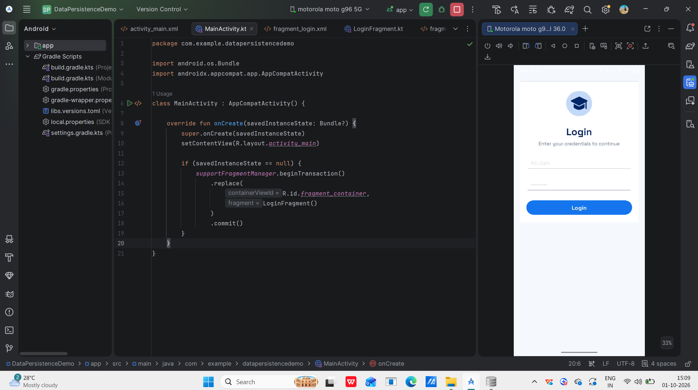
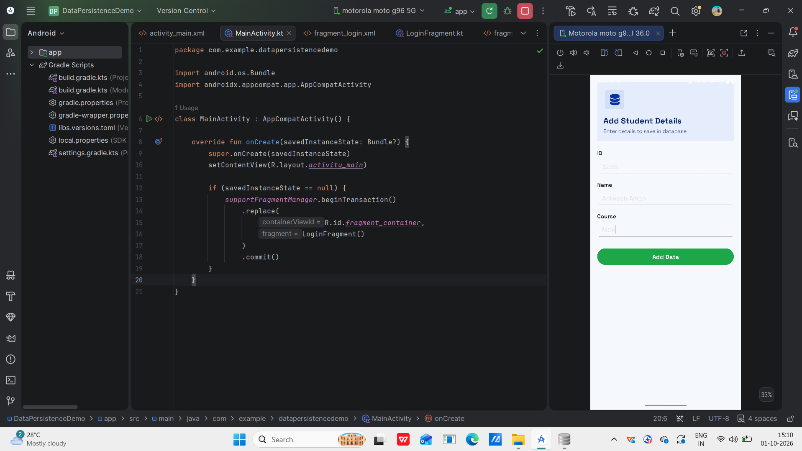
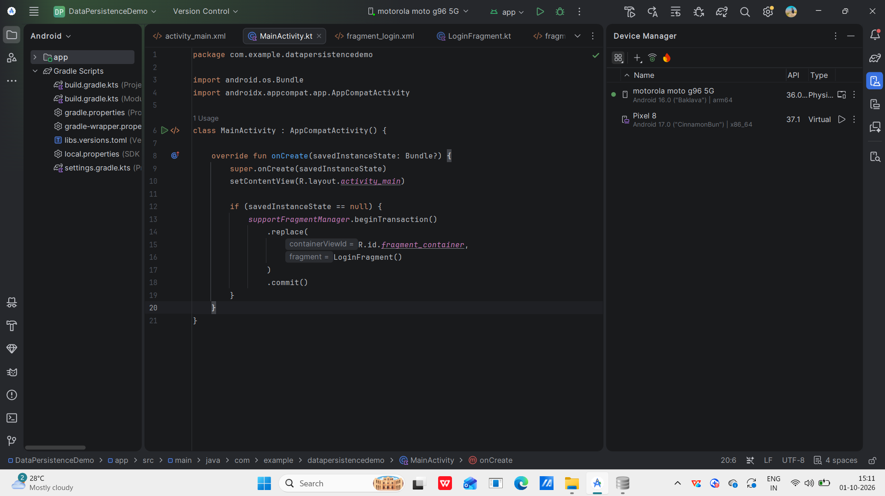
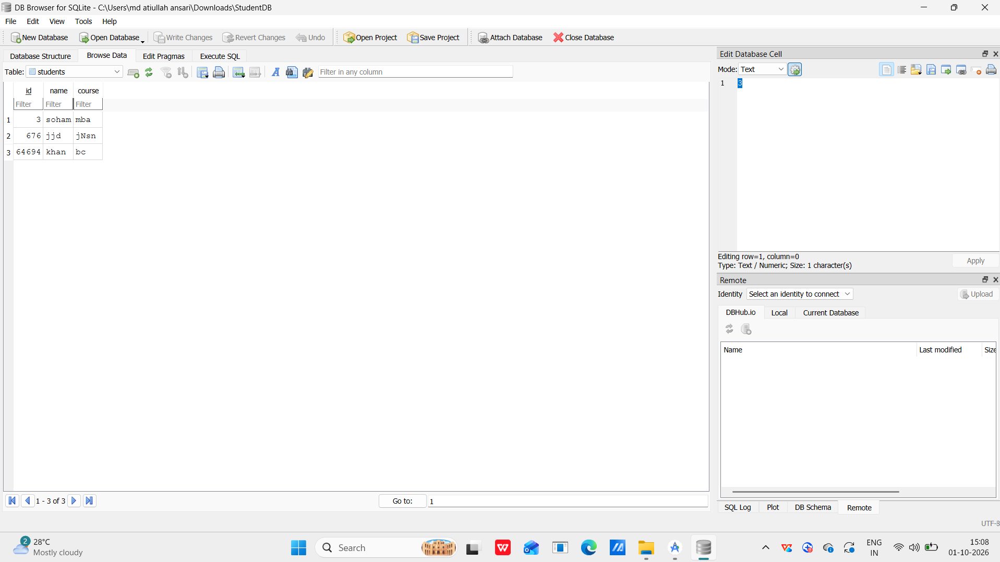
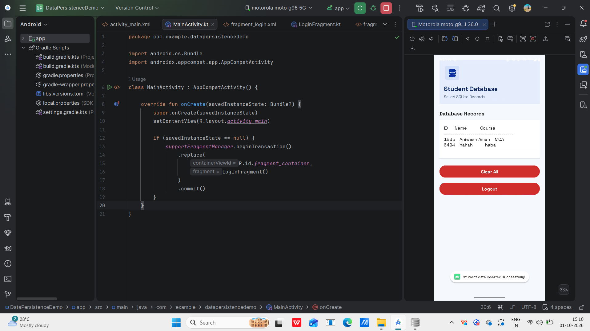

# DataPersistenceDemo

## Experiment: Data Persistence Using SQLite in Android

### Student Details

- **Name:** Md Atiullah Ansari
- **USN:** 25MCAR0108
- **Course:** Master of Computer Applications (MCA)
- **University:** Jain (Deemed-to-be University), Bangalore

---

## Aim

To develop an Android application that demonstrates data persistence using SQLite database for storing, retrieving, and managing student information.

---

## Experiment Overview

This experiment demonstrates data persistence in Android using a local SQLite database.

The application allows the user to login, enter student details, store the details in SQLite, retrieve saved records, display the records, clear the records, and logout.

---

## Concept / Technology Used

### SQLite Database

SQLite is a lightweight relational database used in Android applications to store structured data locally on the device.

### SQLiteOpenHelper

`SQLiteOpenHelper` is used to create and manage the SQLite database. It is responsible for database creation, table creation, database upgrades, and database operations.

### Data Persistence

Data persistence means that data remains stored even after navigating between screens or restarting the application.

---

## Scenario

A Student Data Management application is developed using Android Studio, Kotlin, XML, and SQLite.

The application starts with a Login screen where the user enters a username and password.

After login, the user enters Student ID, Student Name, and Course.

The student information is stored in the local SQLite database and can be retrieved and displayed in the Student Database screen.

The user can also clear all student records and logout from the application.

---

## Technologies Used

- Android Studio
- Kotlin
- XML
- SQLite Database
- SQLiteOpenHelper
- Android SDK

---

## Application Features

- User Login
- Username and Password handling
- Add Student Details
- Store student information in SQLite
- Retrieve student records
- Display saved records
- Clear all student records
- Logout functionality
- SQLite database verification
- Data persistence

---

# Database Structure

The application uses a SQLite database named **StudentDB**.

### Students Table

| Column | Data Type | Description |
|---|---|---|
| id | INTEGER | Student ID |
| name | TEXT | Student Name |
| course | TEXT | Student Course |

### Login Table

| Column | Data Type | Description |
|---|---|---|
| username | TEXT | Login Username |
| password | TEXT | Login Password |

The login details are stored in SQLite using `DatabaseHelper.kt`.

---

# Project Folder and File Structure

```text
DataPersistenceDemo
│
├── app
│   └── src
│       └── main
│           ├── java
│           │   └── com.example.datapersistencedemo
│           │       ├── MainActivity.kt
│           │       ├── LoginFragment.kt
│           │       ├── AddDataFragment.kt
│           │       ├── DatabaseFragment.kt
│           │       └── DatabaseHelper.kt
│           │
│           └── res
│               ├── drawable
│               ├── layout
│               │   ├── activity_main.xml
│               │   ├── fragment_login.xml
│               │   ├── fragment_add_data.xml
│               │   └── fragment_database.xml
│               └── values
│
├── Screenshots
│   ├── LoginScreen.png
│   ├── AddStudentData.png
│   ├── StudentDatabase.png
│   ├── SQLiteDatabase.png
│   └── DatabaseRecords.png
│
├── .gitignore
├── build.gradle.kts
├── gradle.properties
├── gradlew
├── gradlew.bat
└── settings.gradle.kts

# Output Screenshots

## 1. Login Screen

The Login screen allows the user to enter a username and password and proceed to the next screen.



---

## 2. Add Student Data

The Add Student Data screen allows the user to enter Student ID, Student Name, and Course and save the information into SQLite.




---

## 3. Student Database

The Student Database screen displays the student records retrieved from the SQLite database.




---

## 4. SQLite Database

The SQLite database is verified using DB Browser for SQLite. The stored student records can be viewed directly in the database.




---

## 5. Database Records

This screenshot shows the student records successfully stored and retrieved from the SQLite database.



---

# Test Cases

## Test Case 1: Login Test

### Test Data
- Username: Atiullah
- Password: ********

### Procedure
1. Open the application.
2. Enter the username.
3. Enter the password.
4. Click the Login button.

### Expected Output
The user should be successfully logged in and redirected to the Add Student Details screen.

### Output


---

## Test Case 2: Add Student Data Test

### Test Data

| Field | Value |
|---|---|
| Student ID | 1235 |
| Student Name | Aniwesh Aman |
| Course | MCA |

### Procedure
1. Login to the application.
2. Enter the Student ID.
3. Enter the Student Name.
4. Enter the Course.
5. Click the Add Data button.

### Expected Output
The student details should be successfully inserted into the SQLite database.

### Output


---

## Test Case 3: Retrieve Student Records

### Procedure
1. Add student details.
2. Open the Student Database screen.
3. View the saved student records.

### Expected Output
The saved student records should be retrieved from SQLite and displayed correctly in the Student Database screen.

### Output


---

# SQLite Database Verification

The application uses a local SQLite database named **StudentDB**.

The database contains the following tables:

- `students`
- `login`

The SQLite database can be verified using **DB Browser for SQLite** or Android Studio Database Inspector.

### SQLite Database Output


---

# Database Records

The student records stored in SQLite are retrieved and displayed in the Student Database screen.

### Database Records Output


---

# Result

The Android application was successfully developed and tested using Kotlin, XML, and SQLite. The application successfully stores, retrieves, displays, and manages student data using SQLite persistence.

# Conclusion

The experiment successfully demonstrates **Data Persistence in Android using SQLite**. The student information remains stored in the local SQLite database and can be retrieved whenever required.

# GitHub Repository

[DataPersistenceDemo](https://github.com/Atiullah18/DataPersistenceDemo)
